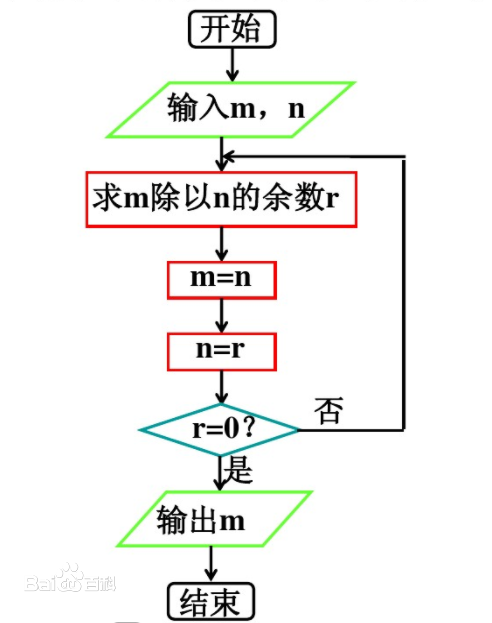

```{r setup, include=FALSE}
options(htmltools.dir.version = FALSE)
library(kableExtra)
```


## 计算机科学 Computer Science

--
- 如何把现实问题转化为计算机语言的表示

--
- 将用自然语言描述的问题转化为计算机语言的表示


--
.darkblue[例: 辗转相除法]

--
.pull-left[
1. 用 $a$ 除以 $b$, 得 $a/b=q$ 余 $r_1$
2. 若 $r_1=0$, 则 $gcd(a,b) = b$; 否则用 $b$ 除以 $r_1$, 得 $b/r_1=q$ 余 $r_2$
3. 若 $r_2=0$, 则 $gcd(a,b)=r_1$; 否则继续用 $r_1$ 除以 $r_2$, 如此继续, 直到能整除为止
4. 最后一个余数为 $0$ 的除数即为 $(a,b)$ 的最大公约数
]

--
.pull-right[

]


---
## 使用计算机解决问题的步骤

--
1. 问题分析

--
2. 总结解决问题的思路 --- .red[算法 (Algorithm)]

--
3. 将解题思路用某种编程语言翻译成计算机语言

--
  - 如何将数据 .red[存储] 在计算机中?
  
--
  - 如何 .red[操作] 这些存储在计算机中的数据?
  
--
  - 如何 .red[更好] 的完成上面两项任务?
  
---
## 数据结构 (Data Structure)

--

.quote[
In computer science, a data structure is a particular way of .red[organizing] and .red[storing] data in a computer so that it can be accessed and modified .red[efficiently]. More precisely, a data structure is a collection of .red[data values], the .red[relationships among them], and the functions or .red[operations] that can be applied to the data.

--- Wikipedia
]

--
.quote[
数据结构 : 数据的存储与操作
]


---
## 数据结构 (Data Structure)

--
- 不同种类的数据结构适合不同种类的应用

--
- 部分数据结构甚至是为了解决特定问题而设计出来的

--
- 正确的数据结构选择可以提高算法的效率

--
.quote[
在计算机程序设计的过程里, 选择适当的数据结构是一项重要工作. 许多大型系统的编写经验显示, 程序设计的困难程度与最终成果的质量与表现, 取决于是否选择了最适合的数据结构.
]


---
## 例: 数字在计算机中是如何存储的?

--
.darkblue[整数]

--
- 将最高位设置为符号位, $1$ 代表负数, $0$ 代表正数

--
  - 正整数在计算机中是以 .red[原码] 的形式存储的

--
  - 负整数在计算机中是以 .red[补码] 的形式存储的. 负数的补码 = 负数的反码 (即原码的非符号位取反) + 1

--

.darkblue[整数的表示范围]

例如一个8位的整数:

- 当其为无符号类型时, 可表示 0~255
- 当其为有符号类型时, 可表示 -128 ~ 127


---
## 例: 数字在计算机中是如何存储的?

为什么整数要用补码的形式来表示呢?

--
- 因为这样物理机器更容易实现

--
- 而且在进行加减运算时, 补码的实现也比较简单
  - (x+y) 的补码 = x 的补码 + y 的补码
  - (x-y) 的补码 = x 的补码 + (-y) 的补码
  
--
- 计算机在实现加减乘除四则运算时, 其实内部只有加法运算


---
## 例: 数字在计算机中是如何存储的?

.darkblue[浮点数]

--
- 任何一个小数都可以表示成 $1.xxx\times2^n$ 的形式

--
- 存储形式: 符号位 + 指数位 + 尾数部分

--


--


---
## 我们是如何控制计算机的?

--

- CPU 只负责计算, 本身不具备智能. 你输入一条指令, 它就运行一次, 然后停下来, 等待下一条指令

--

- 这些指令都是二进制的, 称为操作码, 如加法指令就是 .c[00000011]

--
- .red[编译器] 的作用, 就是将 .red[高级语言] 写好的程序翻译成一条条操作码

--
- 对于人类来说, .red[机器语言] 是不可读的. 为了解决可读性的问题, 以及偶尔的编辑需求, 就产生了 .red[汇编语言]

--


---
## 我们是如何控制计算机的?

--

- 但汇编语言依然难以理解, 可维护性差, 因此就产生了更加易用的所谓 .red[高级语言]. 在这种语言下, 其语法和结构更类似于普通英文, 且 .red[远离对硬件的直接操作], 更加易学易用

--


---
## 抽象数据类型 Abstract Data Type


--

- 数据结构按 .red[值] 是否可分解, 将其分为两类

--
  - 原子类型: 其值不可分解, 通常由编程语言直接提供, 如 C 中的 `int`, `float`, `char` 等
  
--
  - 结构类型: 其值可以分解为若干部分, 由程序员自行设计 


--

- 既然有那么多种类的编程语言 (机器语言, 汇编语言, 高级语言), 那我们是否需要针对某种特定的编程语言来学习数据结构 (如整数的存储和操作)?


---
## 抽象数据类型 Abstract Data Type

.darkblue[抽象数据结构]

.quote[
In computer science, an abstract data type (ADT) is a .red[mathematical model] for data types, where a data type is defined by its behavior (semantics) from the point of view of a user of the data, specifically in terms of .red[possible values], .red[possible operations] on data of this type, and the behavior of these operations. .gray[This contrasts with data structures, which are concrete representations of data, and are the point of view of an implementer, not a user].

--- Wikipedia
]


---
## 抽象数据类型 Abstract Data Type

--
- 比如, 各种计算机都拥有的整数类型就是一个抽象数据类型, 尽管实现方法或有不同, 但他们的数学特性相同

--
.quote[
抽象数据类型的特征是实现与操作分离, 从而实现 .red[封装]
]

--
.darkblue[一个简单的有理数抽象数据类型]

```python
ADT Rational:                   #定义有理数的抽象数据类型
    Rational(int num, int den)    #构造有理数 num/den
    +(Rational r1, Rational r2)    #求出表示 r1+r2 的有理数
    -(Rational r1, Rational r2)    #求出表示 r1-r2 的有理数
    *(Rational r1, Rational r2)   #求出表示 r1*r2 的有理数
    /(Rational r1, Rational r2)   #求出表示 r1/r2 的有理数
    num(Rational r1)               #取有理数 r1 的分子
    den(Rational r1)               #取有理数 r1 的分母
```


---
## Why Python?

--

.quote[Life is short, I use Python.]

--

.darkblue[Java]

```java
public class Main {
  public static void main(String[] args) {
*   System.out.println("hello world");
  }
}
```

--

.pull-left[
.darkblue[C]
```c
#include <stdio.h>
int main()
{
* printf("Hello, World!");
  return 0;
}
```
]

--

.pull-right[
.darkblue[Python]
```python
* print("hello world")
```
]

---
## Python 语言的优点

--

.darkblue[简单]

- Python非常简单, 非常适合人类阅读. 阅读一个良好的 Python 程序就感觉像是在读英语一样. 它使你能够专注于解决问题而不是去搞明白语言本身.

--

.darkblue[易学]

- Python 虽然是用 C 语言写的, 但是它摈弃了 C 中非常复杂的指针, 简化了 Python 的语法.

--

.darkblue[可移植性]

- 所有 Python 程序无需修改就可以在任何平台上面运行.


---
## Python 语言的优点

.darkblue[丰富的库]
- Python 有大量高质量的第三方库可以使用, 来帮助你处理各种工作.

--

.darkblue[规范的代码]
- Python 采用强制缩进的方式使得代码具有极佳的可读性.

--

.darkblue[多种编程范式]

- Python 既支持 .red[面向过程] 的函数编程也支持 .red[面向对象] 的抽象编程. 同时, 与其他主要的语言如 C++ 和 Java 相比, Python 以一种非常强大又简单的方式实现面向对象编程.

---
## Python 语言的优点

.darkblue[可扩展性和可嵌入性]
- .red[胶水语言]: 如果你需要你的一段关键代码运行得更快或者希望某些算法不公开, 你可以把你的部分程序用 C 或 C++ 编写, 然后在你的 Python 程序中使用它们; 同样你可以把 Python 嵌入 C/C++ 程序, 从而向程序用户提供脚本功能.


---
## Python 语言的特性

--

.darkblue[解释型语言]

--

- Python .red[解释器] 把源代码转换成称为字节码的 .red[中间形式], 然后再把它翻译成计算机使用的机器语言并运行

--

- .red[缺点]: 解释型语言每执行一次就要翻译一次, 因此效率通常比编译型语言要低一些.

--

- .red[优点]: 解释型语言方便调试和运行, 尤其适合数据分析工作.

???

因此像开发操作系统、大型应用程序、数据库系统等时都采用如 C/C++ 之类的编译型语言; 而一些网页脚本、服务器脚本及辅助开发接口这样的对速度要求不高、对不同系统平台间的兼容性有一定要求的程序则通常使用解释性语言，如 JavaScript、VBScript、Perl、Python、Ruby、MATLAB 等等.

---
## 参考资料

- [**Data Camp**](https://www.datacamp.com)
- [**Problem Solving with Algorithms and Data Structures using Python**](https://interactivepython.org/runestone/static/pythonds/index.html)
- [**算法导论 (第三版), Thomas H. Cormen**](https://item.jd.com/11144230.html)

---
## 考核方式

- 出勤 10%
- 上机 20%
- 作业 20%
- 期末 50%

## 答疑时间

- 第五学科楼 A222, 周一、二、四
- Email: sit_ds@163.com

---
## 安装 Python 环境: Anaconda

- [**Anaconda 下载链接**](https://www.anaconda.com/download/)
- Jupyter Notebook: Python 交互式笔记本
- Spyder: Python 集成开发环境

