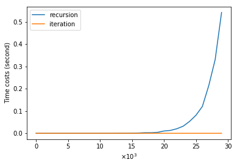
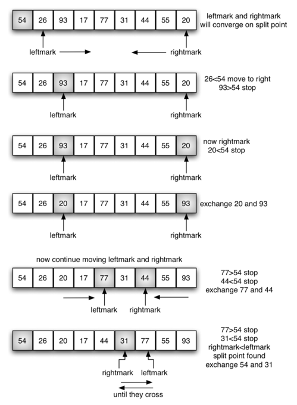

```{r setup, include=FALSE}
options(htmltools.dir.version = FALSE)
knitr::opts_chunk$set(tidy = FALSE, echo=FALSE, message=FALSE, warning=FALSE, fig.align='center')
library(knitr)
library(kableExtra)
```

## 数据结构的基本概念

数据结构描述的是按照一定逻辑关系组织起来的待处理数据元素的表示及相关操作

.quote[结构: 实体 + 关系]

.darkblue[数据结构]

.quote[
- 按照 .red[逻辑关系] 组织起来的一批数据
- 按一定的存储方法把它们 .red[存储] 在计算机中
- 在这些数据上定义了一些 .red[运算] 的集合
]

---
## 数据结构的基本概念

.darkblue[数据的逻辑结构]

从具体问题抽象出来的数据模型, 反映了事物的组成结构及之间的逻辑关系

- .red[集合结构]
  - 结点间没有需要关注的明确关系
- .red[线性结构]
  - 结点间有一种明确的先后关系 (顺序关系)
- .red[非线性结构]
  - 结点间有复杂的相互联系 (如树结构和图结构)

---
## 数据结构的基本概念

.darkblue[数据的存储结构]

逻辑结构在计算机中的物理存储表示

- .red[顺序存储] 把逻辑上相邻的结点存储在物理位置上相邻的存储单元里, 结点间的逻辑关系由存储单元的邻接关系来体现
  
- .red[链接存储] 不要求逻辑上相邻的结点在物理位置上亦相邻, 结点间的逻辑关系由附加的指针字段表示
  
- .red[索引存储] 在储存结点信息的同时，还建立附加的索引表
  
- .red[散列存储] 根据结点的关键字直接计算出该结点的存储地址


---
## 数据结构的基本概念

.darkblue[数据的运算]

建立在数据的逻辑结构之上, 其实现与数据的存储结构紧密相关

--

.darkblue[抽象数据类型 Abstract Data Type]

- 定义了一组运算的数学模型
- 与物理存储结构无关
- 面向对象
- 隐藏运算实现的细节和内部数据结构

---
## 算法概念及设计方法

.quote[数据结构 + 算法 = 程序]

- 算法设计与算法分析是计算机科学的核心问题.

- 通常来说, 所谓算法, 实际上指的是一个执行过程, .red[包含了能够解决某个特定问题的有限步骤集] (其中可能包括了一些循环和条件元素).

---
## 算法概念及设计方法

.pull-left[
- 通常认为算法具有如下性质:
  - 有穷性
  - 可行性
  - 确定性
  - 终止性
  - 输入/输出
]

--
.pull-right[
- 常用算法设计方法:
  - 枚举法
  - 贪心法
  - 分治法
  - 回溯法
  - 动态规划
]

---
## 算法概念及设计方法

.darkblue[练习:] 关于算法特性描述正确的有

a. 算法描述中下一步执行的步骤不确定

b. 算法的有穷性指的是算法必须在有限步骤内结束

c. 组成算法的指令可以有限也可以无限

d. 算法保证计算结果的正确性

---
## 算法评价标准及分析方法

$$1+2+3+\cdots+100 = 5050, \qquad \frac{100\times(1+100)}2 = 5050$$

--
.darkblue[算法的复杂度]

度量算法效率、评价其优劣的重要依据, 体现在运行该算法所需要的计算机资源的多少上, 所需的资源越多表明该算法的复杂性越高

- 时间复杂度
- 空间复杂度

--

.darkblue[算法分析技术]

利用数学工具, 对每一个具体算法讨论其各种复杂度, 以探讨某种具体算法适用于哪类问题, 或某类问题宜采用哪种算法

---
## 算法评价标准及分析方法

.darkblue[例:] 将数字添加到一个列表中

--

.pull-left[
```python
# 依次将数字添加到列表尾端, 
# 然后反转该列表

count = 10**5
nums = []
for i in range(count):
    nums.append(i)
nums.reverse()
```
]

--

.pull-right[
```python
# 每次将数字添加到列表首端

count = 10**5
nums = []
for i in range(count):
    nums.insert(0,i)
```
]

--

.red[问题:] 哪种方法更好?

---
## 算法评价标准及分析方法

.pull-left[
```{r engine='python'}
import time

start = time.time()

count = 10**5
nums = []


for i in range(count):
    nums.append(i)
nums.reverse()


print(time.time()-start)
```
]


.pull-right[
```{r engine='python'}
start = time.time()

count = 10**5
nums = []


for i in range(count):
    nums.insert(0,i)


print(time.time()-start)
```
]


---
## 算法评价标准及分析方法


???

```python
#计算append、insert 操作的运行时间在规模从 10^3 到 10^5 的耗时
cost_time1 = []
for count in range(1, 101):
    start = time.time()
    nums = []
    for i in range(count*1000):
        nums.append(i)
    nums.reverse()
    cost_time1.append(time.time()-start)

cost_time2 = []
for count in range(1, 101):
    start = time.time()
    nums = []
    for i in range(count*1000):
        nums.insert(0,i)
    cost_time2.append(time.time()-start)


#加载 matplotlab 相关作图模块
%pylab inline

mpl.rcParams['font.sans-serif'] = ['FangSong'] # 指定默认字体
mpl.rcParams['axes.unicode_minus'] = False # 解决保存图像是负号'-'显示为方块的问题

plot(cost_time1, label = 'append')
plot(cost_time2, label = 'insert')
xlabel('$\\times 10^3$')
ylabel('Time costs (second)')
title(u'append、insert 操作的运行时间在规模从 $10^3$ 到 $10^5$ 的变化图')
legend()
```

---
## 算法评价标准及分析方法

.darkblue[例:] 求斐波那契数列的第 n 项

$$F_0=F_1=1,\qquad F_n = F_{n-1}+F_{n-2}$$

- 求斐波那契数列的递归算法

.pull-left[
```{r engine='python'}
def fib(n):
    if n <= 1:
        return 1
    else:
        return fib(n-1)+fib(n-2)
```
]

.pull-right[
```{r engine='python'}
now = time.time()
print(fib(30))
print(time.time()-now)
```
]

---
## 算法评价标准及分析方法

将 $n$ 看做问题的规模, 不难得到计算 $F_n$ 的时间代价 (考虑求加法操作的次数) 大致等于
$$\lim_{n\to\infty}F_n=(\frac{\sqrt5+1}2)^n$$

因此计算 $F_n$ 的时间代价按 $n$ 的指数增长. 当 $n=100$ 时, 大约为 $8\times10^(20)$. 如果使用 2014 年全球运算速度最快计算机 "天河二号" 进行计算 (每秒运算 33.86千万亿次), 大约需要运算 6.5 小时.


---
## 算法评价标准及分析方法

- 求解斐波那契数列的迭代算法

.pull-left[
```{r engine='python'}
def fib(n):
    a, b = 1, 1
    for i in range(1,n):
        a, b = a+b, a
    return a
```
]

.pull-right[
```{r engine='python'}
now = time.time()
print(fib(30))
print(time.time()-now)
```
]

--

- 用这个算法计算 $F_n$ 的值, 循环前工作只要做一次, 循环需要做 $n−1$ 次. 因此总的工作量 (基本操作执行次数) 与 $n$ 呈线性关系.


---
## 算法评价标准及分析方法

- 斐波那契数列递归算法与迭代算法的运行时间


---
## 算法复杂度的渐近分析

.quote[需要注意的是, 算法设计首先要担心的并 .red[不是常数级别的性能差异]. 即使相关程序完成任务所需要的时间是另一程序的两倍, 甚至十倍, 但这样的速度可能依然是够快的.]

--
- 并不考虑常数单位上的差距, 这通常取决于编程语言的性能、硬件速度等

--
- 重点关注当问题规模扩大时运行时间的增长幅度

--
- 即将焦点集中在解决问题方法中那些 .red[独立于具体实现] 的属性


---
## 算法复杂度的渐近分析

.darkblue[渐近记号]

$$f(n) = n^2 + 100n + \log n + 1000$$

- 当 .red[数据规模] $n$ 逐步增大时, $f(n)$ 的增长趋势当 $n$ 增大到一定值以后, 计算公式中影响最大的就是 $n$ 的幂次最高的项, 其他的常数项和低幂次项都可以忽略


---
## 算法复杂度的渐近分析

- 大 $O$ 表示法 (上界)

如果存在正数 $c$ 和 $n_0$, 使得对任意 $n>n_0$, 都有 $f(n) \leq cg(n)$, 则称 $$f(n) = O(g(n))$$
    - 表示函数增长的上界
    - 注意: 一个函数增长的上界不唯一
  
--
- 大 $\Omega$ 表示法 (下界)

如果存在正数 $c$ 和 $n_0$, 使得对任意 $n>n_0$, 都有 $f(n) \geq cg(n)$, 则称 $$f(n) = \Omega(g(n))$$
    - 表示函数增长的下界
    - 注意: 一个函数增长的下界不唯一
  

---
## 算法复杂度的渐近分析

- 大 $\Theta$ 表示法

如果存在正数 $c_1,c_2$ 和 $n_0$, 使得对任意 $n>n_0$, 都有 $c_1g(n)\leq f(n) \leq c_2g(n)$, 则称 $$f(n) = \Theta(g(n))$$
    - 表示函数增长的上、下界相同

---
## 算法复杂度的渐近分析

- 长用渐近复杂度
$$O(1),O(\log n),O(n),O(n\log n),O(n^2),O(n^3),O(2^n),O(n!)$$

--
.darkblue[思考]

1. 对数通常有各自不同的底数, 但在算法分析中, 我们往往并不会在意它. 为了明白其中的原因, 考虑以下等式$$\log_bn = \frac{\log_an}{\log_ab}$$. 为什么它能告诉我们并不需要操心对数的底数问题?

--
2. 证明任何指数级操作 ($\Theta(k^n)$, 其中 $k>1$) 的增长都要快于多项式级操作 ($\Theta(n^j)$, 其中 $j >0$)

--
3. 证明任何多项式级操作的渐近增长都要快于对数级操作 ($\Theta(\log n)$)

---
## 算法分析

.quote[算法分析的目的是推导出算法的复杂度]

--
- 基本循环程序的时间复杂度

--
1. .red[基本操作] 认为其时间复杂度为 $O(1)$. 如果是函数调用, 应将其时间复杂度带入, 参与整体时间复杂度的计算.

--
2. .red[加法规则(顺序结构)] 如果算法是两个部分的顺序复合, 其复杂性是这两部分的复杂性之和 $$O(T_1(n)+T_2(n)) = O(\max(T_1(n), T_2(n)))$$

--
3. .red[乘法规则(循环结构)] 如果算法是一个循环, 循环体将执行 $T_1(n)$ 次, 每次循环执行需要时间 $T_2(n)$, 则总的时间为 $O(T_1(n)\times T_2(n))$

--
4. .red[取最大规则(分支结构)] 如果算法是条件分支, 两个分支的时间复杂度分别是 $T_1(n)$ 和 $T_2(n)$, 则有 $O(\max(T_1(n),T_2(n)))$

---
## 算法分析

.darkblue[练习] 求下列代码段的时间复杂度

.pull-left[
```python
# Q1
num = range(n)
num.append(1)
num.insert(0,2)
```

```python
# Q2
s = 0
for x in range(n):
    s += x
```
]

.pull-right[
```python
# Q3
squares = [x**2 for x in range(n)]
```

```python
# Q4
s = 0
for x in range(n):
   for y in range(n):
       s += x*y
```
]

---
## 算法分析

.pull-left[
```python
# Q5
s = 0
for x in range(n):
   for y in range(n):
       s += x*y
   for z in range(n):
       for w in range(n):
           s += x-w
```
]

--

.pull-right[
```python
# Q6 求两个 n×n 矩阵 m1 和 m2 乘积的函数
def multi(m1, m2):
    n = len(m1)
    m = []
    for i in range(n):
       m.append([0]*n)
    for i in range(n):
       for j in range(n):
           for k in range(n):
               m[i][j] += m1[i][k]*m2[k][j]
    return m
```
]


---
## 递归算法的时间复杂度

递归算法通常具有如下模式:

.pull-left[
```python
def fun(n):
*   if n == 0:
*      return g(...)
    somework
*   for i in range(a):
*      x = fun(n/b)
       somework
    somework
```
]

--

.pull-right[
- 当 $n=0$ 时, 直接得到结果
- 否则将原问题归结为 $a$ 个规模为 $n/b$ 的 .red[子问题], 其中 $a,b$ 是由具体问题决定的两个常数
- 另外, 在本层递归中还需要做一些工作, 即 `somework`, 其时间复杂度可能与 $n$ 有关, 设为 $O(n^k)$
]

--

这样就可以得到求解递归算法时间复杂度的 .red[递归方程]
$$T(n)=O(n^k)+a\times T(n/b)$$

---
## 递归算法的时间复杂度

.darkblue[主定理] 

有递归方程: $T(n)=O(n^k)+a\times T(n/b)$

- 如果 $a>b^k$, 则 $T(n)=O(n^{\log_ba})$
- 如果 $a=b^k$, 则 $T(n)=O(n^k\log n)$
- 如果 $a<b^k$, 则 $T(n)=O(n^k)$

---
## 递归算法的时间复杂度

**练习**: 下面排序算法 (.red[归并排序]) 的时间复杂度是

.pull-left[
```python
def mergesort(seq):
    mid = len(seq)//2
    left, right = seq[:mid], seq[mid:]
    if len(left) > 1:
        left = mergesort(left)
    if len(right) > 1:
        right = mergesort(right)
    res = []
    while left and right:
        if left [-1] >= right [-1]:
            res.append(left.pop())
        else:
            res.append(right.pop())
    res.reverse()
    return (left or right) + res
```
]

--

.pull-right[
**练习:** 在上面的算法中, 元素是从序列每一半的尾端弹出 `pop()` 的. 或许选择从首端弹出 `pop(0)` 会更直观一点, 避免我们要对 `res` 进行逆序处理 `res.reverse()`. 那么这种调整对会对整体运行时间产生什么影响呢?
]

---

<iframe width="800" height="1200" frameborder="0" src="http://pythontutor.com/iframe-embed.html#code=def%20mergesort%28seq%29%3A%0A%20%20%20%20mid%20%3D%20len%28seq%29//2%0A%20%20%20%20left,%20right%20%3D%20seq%5B%3Amid%5D,%20seq%5Bmid%3A%5D%0A%20%20%20%20if%20len%28left%29%20%3E%201%3A%0A%20%20%20%20%20%20%20%20left%20%3D%20mergesort%28left%29%0A%20%20%20%20if%20len%28right%29%20%3E%201%3A%0A%20%20%20%20%20%20%20%20right%20%3D%20mergesort%28right%29%0A%20%20%20%20res%20%3D%20%5B%5D%0A%20%20%20%20while%20left%20and%20right%3A%0A%20%20%20%20%20%20%20%20if%20left%20%5B-1%5D%20%3E%3D%20right%20%5B-1%5D%3A%0A%20%20%20%20%20%20%20%20%20%20%20%20res.append%28left.pop%28%29%29%0A%20%20%20%20%20%20%20%20else%3A%0A%20%20%20%20%20%20%20%20%20%20%20%20res.append%28right.pop%28%29%29%0A%20%20%20%20res.reverse%28%29%0A%20%20%20%20return%20%28left%20or%20right%29%20%2B%20res%0A%0Al%20%3D%20%5B12,32,5,10,3,1%5D%0A%0Amergesort%28l%29&codeDivHeight=400&codeDivWidth=350&cumulative=false&curInstr=0&heapPrimitives=false&origin=opt-frontend.js&py=3&rawInputLstJSON=%5B%5D&textReferences=false"> </iframe>
---
## 三种重要情况

到目前为止, 我们所设想的运行时间都是完全确定的, 并且只取决于输入的规模, 而与输入的实际内容无关. 但这显然不是特别现实. 例如, 如果想要构造一个排序算法, 我们或许会这样开始:

```python
def sort(seq):
  n = len(seq)
  #如果for循环没有被break语句提前中止, 则执行 else 分支
  for i in range(n-1) 
      if seq[i] > seq[i+1]:
          break
  else:
      return
  ...
  ...
```

--
- 这意味着无论我们的主排序算法效率有多低, 只要遇到一个已经排序的序列, 则其运行时间始终是线性级别的. **然而在一般情况下是没有排序算法能达到线性级运行时间的**


---
## 三种重要情况

- .red[最好情况]
    - 当算法遇上最理想输入时的运行时间, 实际价值不大
- .red[最坏情况]
    - 可能会遇上的最糟糕的运行时间, 这通常也是最有用的情况
- .red[平均情况]
    - 最复杂的一种情况, 大部分时间里会回避对这种情况的讨论
    
---
## 三种重要情况

.red[侏儒排序]

```python
def gnomesort(seq):
    i = 0
    while i < len(seq):
        if i == 0 or seq[i-1] <= seq[i]:
            i += 1
        else:
            seq[i], seq[i-1] = seq[i-1], seq[i]
            i -= 1
```

- 在最好情况下的时间复杂度是?

--
- 在最差情况下的时间复杂度是?


--

.red[思考:] 归并排序法在最好、最差和平均情况下的时间复杂度分别是多少?

---

<iframe width="800" height="1200" frameborder="0" src="http://pythontutor.com/iframe-embed.html#code=def%20gnomesort%28seq%29%3A%0A%20%20%20%20i%20%3D%200%0A%20%20%20%20while%20i%20%3C%20len%28seq%29%3A%0A%20%20%20%20%20%20%20%20if%20i%20%3D%3D%200%20or%20seq%5Bi-1%5D%20%3C%3D%20seq%5Bi%5D%3A%0A%20%20%20%20%20%20%20%20%20%20%20%20i%20%2B%3D%201%0A%20%20%20%20%20%20%20%20else%3A%0A%20%20%20%20%20%20%20%20%20%20%20%20seq%5Bi%5D,%20seq%5Bi-1%5D%20%3D%20seq%5Bi-1%5D,%20seq%5Bi%5D%0A%20%20%20%20%20%20%20%20%20%20%20%20i%20-%3D%201%0A%20%20%20%20%20%20%20%20%20%20%20%20%0Al%20%3D%20%5B2,%2010,%2012,%205,%2048,%203,%207,%201%5D%0A%0Agnomesort%28l%29&codeDivHeight=400&codeDivWidth=350&cumulative=false&curInstr=0&heapPrimitives=false&origin=opt-frontend.js&py=3&rawInputLstJSON=%5B%5D&textReferences=false"> </iframe>


---
## 时间、空间权衡

- 数据结构
    - 一定的空间来存储它的每一个数据项
    - 一定的时间来执行每一个操作

- 代价和效益
    - 空间和时间的限制
    - 增大空间开销可能改善算法的时间开销
    - 想要节省空间, 往往需要增大运行时间

---
## 练习

已知一个列表 `a` 的长度为 $n$, 则下面这段代码

```python
length = 1
for i in range(n):
    j = i+1
    while j < n and a[j-1] <= a[j]:
        if length < j-i+1:
            length = j-i+1
        j += 1
```
- 在最好情况下的时间复杂度是?
- 在最差情况下的时间复杂度是?
- 到底做了件什么事? 

---
## 搜索算法

- .red[搜索最小值]

```python
def indexOfMin(lyst):

    minIndex = 0
    currentIndex = 1
        while currentIndex < len(lyst):
            if lyst[currentIndex] < lyst[minIndex]:
                minIndex = currentIndex
            currentIndex += 1
    return minIndex
```

---
## 搜索算法

- .red[顺序搜索一个列表]

```python
def sequentialSearch(target, lyst):
    position = 0
    while position < len(lyst):
        if target == lyst[position]:
            return position
        position += 1
    return -1
```

--
- 问题: 最好情况、最坏情况和平均情况的性能?

---
## 搜索算法

- .red[有序列表的二叉搜索]

```python
def binarySearch(target, sortedLyst):

    left = 0
    right = len(sortedLyst) - 1
    while left <= right:
        midpoint = (left + right) // 2
        if target == sortedLyst[midpoint]:
            return midpoint
        elif target < sortedLyst[midpoint]:
            right = midpoint - 1
        else:
            left = midpoint + 1
    return -1
```

--

- 二叉搜索的最坏情况的时间复杂度为?


---
## 搜索算法

<iframe width="800" height="1200" frameborder="0" src="http://pythontutor.com/iframe-embed.html#code=def%20binarySearch%28target,%20sortedLyst%29%3A%0A%20%20%20%20left%20%3D%200%0A%20%20%20%20right%20%3D%20len%28sortedLyst%29%20-%201%0A%20%20%20%20while%20left%20%3C%3D%20right%3A%0A%20%20%20%20%20%20%20%20midpoint%20%3D%20%28left%20%2B%20right%29%20//%202%0A%20%20%20%20%20%20%20%20if%20target%20%3D%3D%20sortedLyst%5Bmidpoint%5D%3A%0A%20%20%20%20%20%20%20%20%20%20return%20midpoint%0A%20%20%20%20%20%20%20%20elif%20target%20%3C%20sortedLyst%5Bmidpoint%5D%3A%0A%20%20%20%20%20%20%20%20%20%20right%20%3D%20midpoint%20-%201%0A%20%20%20%20%20%20%20%20else%3A%0A%20%20%20%20%20%20%20%20%20%20left%20%3D%20midpoint%20%2B%201%0A%20%20%20%20return%20-1%0A%0Al%20%3D%20%5B20,%2044,%2048,%2055,%2062,%2066,%2074,%2088,%2093,%2099%5D%0AbinarySearch%2890,%20l%29&codeDivHeight=400&codeDivWidth=350&cumulative=false&curInstr=24&heapPrimitives=false&origin=opt-frontend.js&py=3&rawInputLstJSON=%5B%5D&textReferences=false"> </iframe>


---
## 搜索算法

.red[比较数据项]

- 二叉搜索与搜索最小项, 都是假设列表中的项都是可以互相比较的
- 在 Python 中, 数字、字符串都是可比的
- 如何对一个特殊的对象添加"比较"功能？

--

- 为对象添加 `__eq__`, `__lt__`, `__gt__` 方法

---
## 搜索算法

```python
class SavingAccount(object):

    def __init__(self, name, pin, balance = 0.0):
        self.name = name
        self.pin = pin
        self.balance = balance
    
    def __lt__(self, other):
        return self.name < other.name
    
    def __gt__(self, other):
        return self.name > other.name
    
    def __eq__(self, other):
        return self.name == other.name
```

--

- [代码演示](http://pythontutor.com/visualize.html#code=class%20SavingAccount%28object%29%3A%0A%20%20%22%22%22This%20class%20represents%20a%20saving%20account%20with%0A%20%20the%20owner's%20name,%20PIN,%20and%20balance.%22%22%22%0A%20%20%0A%20%20def%20__init__%28self,%20name,%20pin,%20balance%20%3D%200.0%29%3A%0A%20%20%20%20self.name%20%3D%20name%0A%20%20%20%20self.pin%20%3D%20pin%0A%20%20%20%20self.balance%20%3D%20balance%0A%20%20def%20__lt__%28self,%20other%29%3A%0A%20%20%20%20return%20self.name%20%3C%20other.name%0A%20%20%20%20%0A%20%20def%20__gt__%28self,%20other%29%3A%0A%20%20%20%20return%20self.name%20%3E%20other.name%0A%20%20%20%20%0A%20%20def%20__eq__%28self,%20other%29%3A%0A%20%20%20%20return%20self.name%20%3D%3D%20other.name%0A%20%20%20%20%0As1%20%3D%20SavingAccount%28%22Ken%22,%20%221000%22,%200%29%0As2%20%3D%20SavingAccount%28%22Bill%22,%20%221001%22,%2030%29%0A%0Aprint%28s1%20%3C%20s2%29&cumulative=false&heapPrimitives=false&mode=edit&origin=opt-frontend.js&py=3&rawInputLstJSON=%5B%5D&textReferences=false)
- 这样就可以将账户放置在列表中并且按照姓名来进行查找了

---
## 排序 (Sorting)

- 排序是计算机中最重要的工作之一, 也是许多算法的重要组成部分, 在许多算法里需要对计算中使用的数据进行排序, 如二叉搜索.

--

- .red[基于比较的排序]
  - 基于数据元素中的关键字及其比较操作的排序.

- .red[内排序]
  - 在执行过程中, 如果待排序列全部保存在内存中.

- .red[外排序]
  - 针对外寸 (硬盘、非本地存储等) 数据的排序工作.

---
## 排序的基本操作

在基于关键字比较的排序算法中, 两种最重要的基本操作是:

- 比较关键字的操作, 通过这种操作确定数据的顺序关系.
- 移动数据记录的操作, 用于调整记录的位置和 (或) 顺序.

--

.quote[
可以证明, 基于关键字比较的排序算法的时间复杂度不可能优于 $O(n\log n)$
]


---
## 排序的稳定性

如果某个排序算法能保证: 对于待排序列里任一对关键字相同的记录 $R_i$
 和 $R_j$, 在排序之后的序列里 $R_i$ 与 $R_j$ 的前后顺序不变, 则称这种排序算法是稳定的.

--

例: 现要按照绩点对全系学生进行排序. 在排序之前, 全体学生记录是按照年级分段存放的. 如果用一个稳定的排序算法进行排序, 在得到的结果中, 绩点相同的学生的记录也是按年级分段的. 而如果用一个不稳定的排序算法进行处理则各年级同学的记录将混乱交错.

---
## 基本排序算法

- .red[冒泡排序]
- [可视化](https://www.hackerearth.com/zh/practice/algorithms/sorting/bubble-sort/tutorial/)

```python
def bubbleSort(lyst):
  
    n = len(lyst)
    
    while n > 1:
        i = 1
        while i < n:
            if lyst[i] < lyst[i-1]:
                lyst[i], lyst[i-1] = lyst[i-1], lyst[i]
            i += 1
        n -= 1
```

--

- [代码演示](http://pythontutor.com/visualize.html#code=def%20bubbleSort%28lyst%29%3A%0A%20%20%0A%20%20n%20%3D%20len%28lyst%29%0A%20%20%0A%20%20while%20n%20%3E%201%3A%0A%20%20%20%20i%20%3D%201%0A%20%20%20%20while%20i%20%3C%20n%3A%0A%20%20%20%20%20%20if%20lyst%5Bi%5D%20%3C%20lyst%5Bi-1%5D%3A%0A%20%20%20%20%20%20%20%20lyst%5Bi%5D,%20lyst%5Bi-1%5D%20%3D%20lyst%5Bi-1%5D,%20lyst%5Bi%5D%0A%20%20%20%20%20%20i%20%2B%3D%201%0A%20%20%20%20n%20-%3D%201%0A%20%20%20%20%0Al%20%3D%20%5B10,%208,%201,%203,%209,%205%5D%0A%0AbubbleSort%28l%29&cumulative=false&curInstr=59&heapPrimitives=false&mode=display&origin=opt-frontend.js&py=3&rawInputLstJSON=%5B%5D&textReferences=false)
- 冒泡排序的时间复杂度是？空间复杂度是？是稳定的么?

---
## 基本排序算法

- .red[选择排序]
- [可视化](https://www.hackerearth.com/zh/practice/algorithms/sorting/selection-sort/tutorial/)

```python
def selectionSort(lyst):
     i = 0
     while i < len(lyst) - 1:
        minIndex = i
        j = i + 1
        while j <len(lyst):
            if lyst[j] < lyst[minIndex]:
                minIndex = j
            j += 1
        if minIndex != i:
            lyst[minIndex], lyst[i] = lyst[i], lyst[minIndex]
        i += 1
```

--

- [代码演示](http://pythontutor.com/visualize.html#code=def%20selectionSort%28lyst%29%3A%0A%20%20%20i%20%3D%200%0A%20%20%20while%20i%20%3C%20len%28lyst%29%20-%201%3A%0A%20%20%20%20minIndex%20%3D%20i%0A%20%20%20%20j%20%3D%20i%20%2B%201%0A%20%20%20%20while%20j%20%3Clen%28lyst%29%3A%0A%20%20%20%20%20%20if%20lyst%5Bj%5D%20%3C%20lyst%5BminIndex%5D%3A%0A%20%20%20%20%20%20%20%20minIndex%20%3D%20j%0A%20%20%20%20%20%20j%20%2B%3D%201%0A%20%20%20%20if%20minIndex%20!%3D%20i%3A%0A%20%20%20%20%20%20lyst%5BminIndex%5D,%20lyst%5Bi%5D%20%3D%20lyst%5Bi%5D,%20lyst%5BminIndex%5D%0A%20%20%20%20i%20%2B%3D%201%0A%20%20%20%20%0Al%20%3D%20%5B10,%208,%201,%203,%209,%205%5D%0A%0AselectionSort%28l%29&cumulative=false&curInstr=81&heapPrimitives=false&mode=display&origin=opt-frontend.js&py=3&rawInputLstJSON=%5B%5D&textReferences=false)
- 选择排序的时间复杂度是？空间复杂度是？是稳定的么?


---
## 基本排序算法

- .red[插入排序]
- [可视化](https://www.hackerearth.com/zh/practice/algorithms/sorting/insertion-sort/tutorial/)

```python
def insertSort(lyst):
    i = 1
    while i < len(lyst):
        itemToInsert = lyst[i]
        j = i - 1
        while j >= 0:
            if itemToInsert < lyst[j]:
                lyst[j + 1] = lyst[j]
                j -= 1
            else:
                break
        lyst[j + 1] = itemToInsert
        i += 1
```

--

- [代码演示](http://pythontutor.com/visualize.html#code=def%20insertSort%28lyst%29%3A%0A%20%20i%20%3D%201%0A%20%20while%20i%20%3C%20len%28lyst%29%3A%0A%20%20%20%20itemToInsert%20%3D%20lyst%5Bi%5D%0A%20%20%20%20j%20%3D%20i%20-%201%0A%20%20%20%20while%20j%20%3E%3D%200%3A%0A%20%20%20%20%20%20if%20itemToInsert%20%3C%20lyst%5Bj%5D%3A%0A%20%20%20%20%20%20%20%20lyst%5Bj%20%2B%201%5D%20%3D%20lyst%5Bj%5D%0A%20%20%20%20%20%20%20%20j%20-%3D%201%0A%20%20%20%20%20%20else%3A%0A%20%20%20%20%20%20%20%20break%0A%20%20%20%20lyst%5Bj%20%2B%201%5D%20%3D%20itemToInsert%0A%20%20%20%20i%20%2B%3D%201%0A%20%20%20%20%0Al%20%3D%20%5B10,%208,%201,%203,%209,%205%5D%0A%0AinsertSort%28l%29&cumulative=false&curInstr=79&heapPrimitives=false&mode=display&origin=opt-frontend.js&py=3&rawInputLstJSON=%5B%5D&textReferences=false)
- 插入排序的时间复杂度是？空间复杂度是？是稳定的么?

---
## 插入排序

.quote[
插入排序不适合对于数据量比较大的排序应用. 但是, 如果需要排序的数据量很小, 例如, 量级小于千, 那么插入排序还是一个不错的选择. 插入排序在工业级库中也有着广泛的应用，在 STL 的 sort 算法和 stdlib 的 qsort 算法中, 都将插入排序作为快速排序的补充, 用于少量元素的排序 (通常为8个或以下)
]


---
## 快速排序

.quote[
快速排序, 又称划分交换排序 (partition-exchange sort), 是一种排序算法, 最早由英国计算机科学家 C. A. R. Hoare 于 1962 年提出. 它采用了分治法的思想, 在各种基于关键字比较的算法中, 快速排序是实践中平均速度最快的算法. 快速排序算法还被评为 “20 世纪最具影响力的十个算法” 之一.
]

---
## 快速排序

.red[算法描述]

快速排序使用分治法策略把一个序列分为两个子序列

1. 从数列中挑出一个元素, 称为 “基准” (pivot)
2. 重新排序数列, 所有比基准值小的元素移动到基准前, 所有比基准值大的移动到基准后 (相同的数可以到任一边). 这个操作结束后, 该基准就处于数列的中间位置. 这称为分割操作 (partition).
3. 递归的把小于基准值元素的子序列和大于基准值元素的子序列排序. 当序列长度是 0 或 1 时, 递归结束.

---
## 快速排序: 例

- 选择 54 为基准

```{r}
include_graphics("firstsplit.png")
```

--

- 分割操作
    - 增加 ``leftmark`` 直到对应值大于基准
    - 减少 ``rightmark`` 直到对应值小于基准
    - 交换 ``leftmark`` 与 ``rightmark`` 对应元素
    - 当 ``rightmark`` < ``leftmark`` 时分割结束

---
## 快速排序: 例

```{r}

```

---
## 快速排序: 例

- 对子序列递归

```{r}
include_graphics("partitionB.png")
```

--
- [可视化](https://www.hackerearth.com/zh/practice/algorithms/sorting/quick-sort/tutorial/)

---
## 快速排序

```python
def quickSortHelper(alist, first, last):

    if first < last:
        splitpoint = partition(alist, first, last)
        quickSortHelper(alist, first, splitpoint-1)
        quickSortHelper(alist, splitpoint+1, last)

def quickSort(alist):
    quickSortHelper(alist, 0, len(alist)-1)
```

---
## 快速排序

```python
def partition(alist, first, last):

    pivot = alist[first]
    leftmark = first + 1
    rightmark = last

    done = False
    while not done:
        while leftmark <= rightmark and alist[leftmark] <= pivot:
            leftmark += 1

        while leftmark <= rightmark and alist[rightmark] >= pivot:
            rightmark -= 1

        if leftmark < rightmark:
            alist[leftmark], alist[rightmark] = alist[rightmark], alist[leftmark]
        else:
            done = True

    alist[rightmark], alist[first] = alist[first], alist[rightmark]

    return rightmark
```

--

- [代码演示](http://pythontutor.com/visualize.html#code=def%20partition%28alist,%20first,%20last%29%3A%0A%20%20%20%20%0A%20%20%20%20pivot%20%3D%20alist%5Bfirst%5D%0A%20%20%20%20leftmark%20%3D%20first%20%2B%201%0A%20%20%20%20rightmark%20%3D%20last%0A%0A%20%20%20%20done%20%3D%20False%0A%20%20%20%20while%20not%20done%3A%0A%20%20%20%20%20%20%20%20while%20leftmark%20%3C%3D%20rightmark%20and%20alist%5Bleftmark%5D%20%3C%3D%20pivot%3A%0A%20%20%20%20%20%20%20%20%20%20%20%20leftmark%20%2B%3D%201%0A%0A%20%20%20%20%20%20%20%20while%20leftmark%20%3C%3D%20rightmark%20and%20alist%5Brightmark%5D%20%3E%3D%20pivot%3A%0A%20%20%20%20%20%20%20%20%20%20%20%20rightmark%20-%3D%201%0A%0A%20%20%20%20%20%20%20%20if%20leftmark%20%3C%20rightmark%3A%0A%20%20%20%20%20%20%20%20%20%20%20%20alist%5Bleftmark%5D,%20alist%5Brightmark%5D%20%3D%20alist%5Brightmark%5D,%20alist%5Bleftmark%5D%0A%20%20%20%20%20%20%20%20else%3A%0A%20%20%20%20%20%20%20%20%20%20%20%20done%20%3D%20True%0A%0A%20%20%20%20alist%5Brightmark%5D,%20alist%5Bfirst%5D%20%3D%20alist%5Bfirst%5D,%20alist%5Brightmark%5D%0A%0A%20%20%20%20return%20rightmark%0A%0A%0Adef%20quickSortHelper%28alist,%20first,%20last%29%3A%0A%0A%20%20%20%20if%20first%20%3C%20last%3A%0A%20%20%20%20%20%20%20%20splitpoint%20%3D%20partition%28alist,%20first,%20last%29%0A%20%20%20%20%20%20%20%20quickSortHelper%28alist,%20first,%20splitpoint-1%29%0A%20%20%20%20%20%20%20%20quickSortHelper%28alist,%20splitpoint%2B1,%20last%29%0A%0Adef%20quickSort%28alist%29%3A%0A%20%20%20%20quickSortHelper%28alist,%200,%20len%28alist%29-1%29%0A%0A%0Aalist%20%3D%20%5B54,26,93,17,77,31,44,55,20%5D%0AquickSort%28alist%29%0Aprint%28alist%29&cumulative=false&curInstr=82&heapPrimitives=false&mode=display&origin=opt-frontend.js&py=3&rawInputLstJSON=%5B%5D&textReferences=false)

---
## 快速排序的复杂度

- 时间复杂度
  - 如果每次划分都能把所处理区域分成长度基本相等的两段, 由主定理可得时间复杂度为 $O(n\log n)$
  - 如果每次划分得到的两段中总有一个未空, 则 $T(n)=T(n-1)+O(n)$, 则有最差情况时间复杂度为 $O(n^2)$
  - 因此 **快速排序的时间复杂度与基准的选取相关**

--

- 空间复杂度
    快速排序的空间开销主要用于递归时解释器运行时使用的栈空间, 与具体的实现有关. 一般认为其空间复杂度为 $O(\log n)$

---
## 快速排序的复杂度

.quote[
在平均情况下, 快速排序的时间复杂度为 $O(n\log n)$, 在最坏情况下则需要 $O(n^2)$, 但这种情况并不常见. 事实上, 通过恰当的选择基准, 快速排序通常明显比其他 $O(n\log n)$ 算法更快, 因为它的内部循环 (inner loop) 可以在大部分的架构上很有效率地被实现出来.
]

---
## 练习:

1. 对序列 [14, 17, 13, 15, 19, 10, 3, 16, 9, 12] 使用快速排序算法, 在两次分割操作之后, 该序列为?

--

2. 常用的一种基准选取方案称为 “middle of 3”, 即取序列中第一个、中间位置、最后一个, 3个数的中位数为基准. 采用这种方法对序列 [1, 20, 11, 5, 2, 9, 16, 14, 13, 19] 进行快速排序, 第一次分割采用的基准值为?

--

3. 快速排序算法是稳定的么?

    